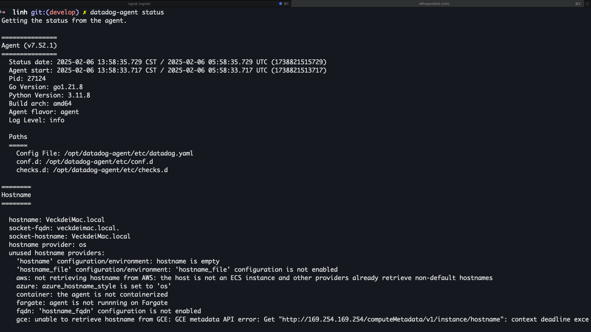

+++
date = '2025-03-07T12:18:52+08:00'
draft = true
title = 'Datadog Agent Test'
+++

1. 安裝 Datadog Agent on macOS: https://docs.datadoghq.com/agent/basic_agent_usage/osx/
2. 安裝 Datadog dogshell on macOS: https://docs.datadoghq.com/developers/guide/dogshell/

安裝好以後確認一下 dogshell 有正常運作

